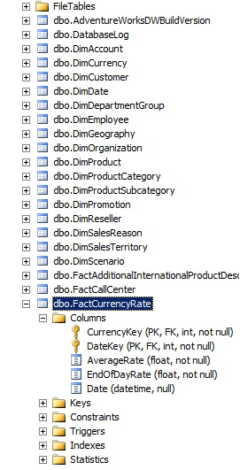
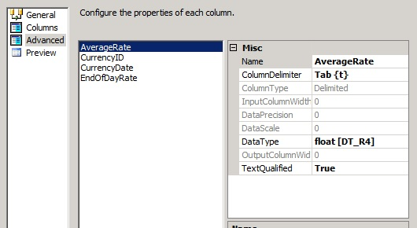
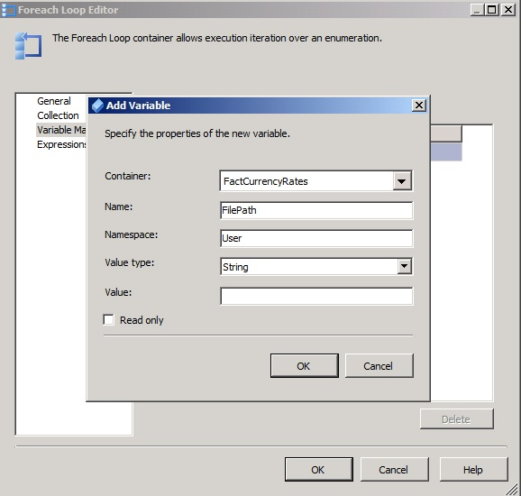
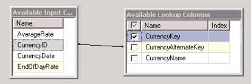
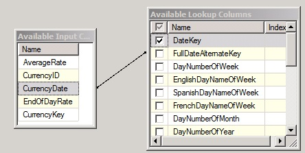
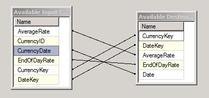

# ETL Dynamic Package Solution for AdventureWorks

AdventureWorks is a Microsoft-supplied sample that model a fictitious bicycle company. Microsoft provided the OLTP and the OLAP DW. We will design and implement an ETL project consisting of several packages, with one master package, that load data from different sources. 

### Environment
* Microsoft SQL Server Management Studio 2012 (SSMS)
* Microsoft SQL Server Data Tools

### Problem
We have a folder with several .txt files ('SampleData' folder) with important data that we need to load it into our fact table 'FactCurrencyRates'. Since our 'FactCurrencyRate' table have two primary keys ('CurrencyKey' and 'DateKey') we need to load up those dimensions as well ('DimCurrency' and 'DimDate'). Therefore, our plan is to use a combination of loops, expressions, flat file connection managers, and a data flow to load these files dynamically. 

  

### Tasks
1. First we add a project connection manager, OLTP AdventureWorks database as well as our staging AdventureWorks DW environment. The SQL code that we used to create our staging environment from our current DW is in the `Script` folder. 
2. We are going to start with the 'DimDate' package. In this package, we only need to add an Execute SQL Task to generate dates using `DimDateSQLQuery` in our SQLStatement. This T-SQL code generates dates from a time frame that we specify. Our connection manager is going to be our staging environment because we are doing an insert into our 'DimDate' table. The control view of 'DimDate' package is the following: 

  

3. In our 'DimCurrency' package, we added an Execute SQL task specifying in our connection tab our OLTP data store. This is because we are going to get our data using a SQL query from a table called 'Sales.Currency' and inserted in our staging DW. The control view of 'DimCurrency' package is the following: 

  

4. For our 'FactCurrencyRate' package, we are going to do the following tasks: 
* First, we add a local Flat File connection manager to all of our .txt `SampleData` which are the ones that we are going to load up. In addiion, it is required to name our columns and select the corresponding DataType in our columns. The following is a view of our Flat File Connection Manager Editor:

  

* We drag a Foreach Loop Container to our Control Flow tab. Our interest is to use a foreach file enumerator to loop into our folder. We are going to set up a variable (@FilePath) with our folder path and then use an expression to tie the directory to the variable. In this way, we have a centralized spot for all of our configurations. The next step is to create a variable @FileRootDir in order to create an expression in our Foreach Loop Container that will make it more dynamic. Now that we have our loop set up and we have our variables set up, we are going to create the expression in our flat file connection manager that iterates with our @FilePath variable. 

  

* The next step is to set up our Data FLow inside of our foreach loop. We are going to rename it as 'FactCurrencyRates'. Here, our source is a 'Flat File Source' and our columns are going to be the following. Here, the only data that we are going to really use is the AverageRate and EndOfDatRate. We are going to use CurrencyID and CurrencyDate to look up into our dimensions to get the right keys since our fact tables is all bout keys.  

  

* The next step is to add a 'Lookup transformation' in our 'FactCurrencyRates' data flow and we are going to look up into our DW 'Dim.Currency' table looking for the 'CurrencyKey' by joining the 'CurrencyID' to the currency alternate key (pulling out the currency key) as it is shown in the picture. Also, we are going to specify that everything that does not match we are going to redirect it to the no match up. In this way, if we don't have any matches we can log it and it won't fail the entire process. 

  

* Next, we are going to do another lookup in our DW 'Dim.Date' table to extract the DateKey. Also, we are going to specify that everything that does not match we are going to redirect it to the no match up. In this way, if we don't have any matches we can log it and it won't fail the entire process.

  

* The last step inside of our 'FactCurrencyRates' data flow is going to load the data inside of our Fact table. So, we drag into our data flow an OLE DB Destination where the mapping is the following: 

  

* The final result of our 'FactCurrencyRates' data flow is the following:

  

* Now, one of the goals is to archive a file. So, we are going to run these file systems test on expressions to generate a folder based on the current date. Thus, any time that we run this process, we will get a folder that is automatically created with a date stamp on it and then all of the files will get copied into that folder. In order to make this happen, we are going to need to use the file system task inside of our foreach loop to basically say that when it is done with the file, push it over into the archive directory. First, we are going to manually create an archive directory. Then, we specify a variable 'ArchiveRootDir' and we run this variable in an expression using @[Users::FileRootDir] + ""\\Archive\\" which append the word "Archive" onto the end of it. In addition, we are going to need another variable called 'ArchiveFileDir' which is going to be the file directory because we are going to make more directories inside of the Archive file. For the 'ArchiveFileDir' we are going to use an expression task containing `ArchiveDirExpression.txt`. The results of our data flow is the following

  

