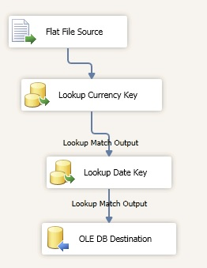

# ETL Dynamic Package Solution for AdventureWorks

AdventureWorks is a Microsoft-supplied sample that model a fictitious bicycle company. Microsoft provided the OLTP and data warehouse. We will design and implement an ETL project consisting of several packages that load data warehose tables.

### Environment
* Microsoft SQL Server Management Studio 2012
* Microsoft SQL Server Data Tools

### Problem
We have several .txt files with data that we need to load it into our FactCurrencyRates table. Since our FactCurrencyRates table have to primary key (CurrencyKey and DateKey) we need to load up those dimensions as well (DimeCurrency and DimDate). Therefore, our plan is to use a combination of loops, expressions, flat file connection manager, and a data flow to load these files dynamically. 

  

### Tasks
1. First we add our project connection managers: OLTP AdventureWorks database as well as our staging AdventureWorks DW environment. 
2. In our DimDate package: we only need to add an Execute SQL task to generate dates using `DimDateSQLQuery` in our SQLStatement.

  

3. In our DimCurrency package: we need to add an Execute SQL task specifying our OLTP database because we are going to get our data from a table called Sales.Currency. 
4. In our FactCurrencyRates package: 
* First we add a local Flat File connection manager to all of our .txt `SampleData` which are the ones that we are going to load up. In addiion, it is required to name our columns and select the corresponding data type in our columns. 
* We drag a Foreach Loop Container to our Control Flow tab. We are going to set up a variable (@FilePath) with the path and then use an expression to tie the directory to the variable. In this way, we a centralized spot for all of our configurations. 

  

* Now, we are going to create a variable @FileRootDir in order to create an expression in our Foreach Loop Container
* In our Currency Connection Manager, we are going to build the expression to iterate with our @FilePath variable. 
* Now, we are going to set our Data FLow inside of our Loop. 

  

* We are going to do a Lookup in our DW Dim.Currency and we are going to look up the currency key by joining the currency ID to the currency alternate key (pulling out the currency key). 

  

* We are going to need another lookup for our Date look up which is going to be the Lookup Match Output. 

  

* Finally we have to put the data in our destination so we drag an OLE DB Destination. The column mapping is the following: 

  

* The final result is the following Data Flow:

  

* 
